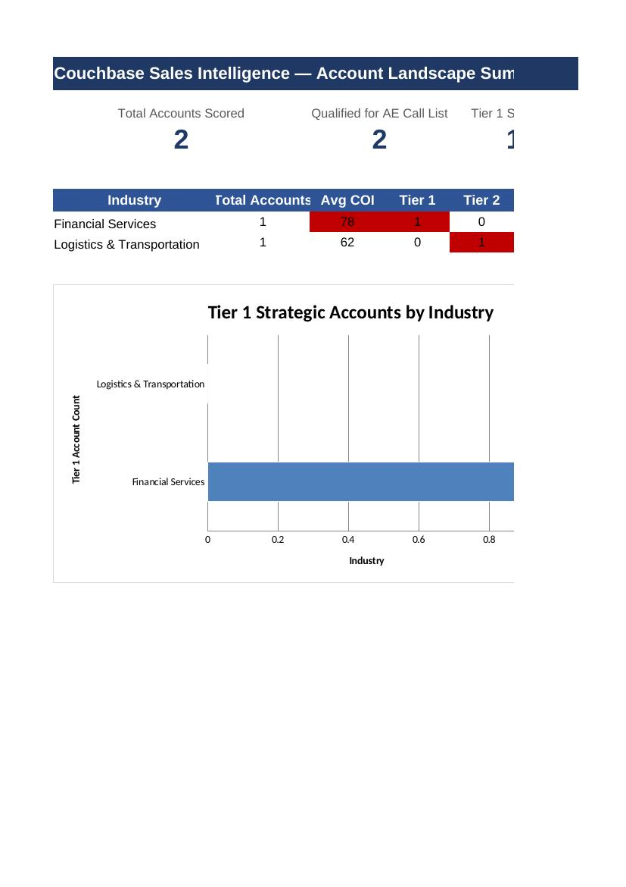
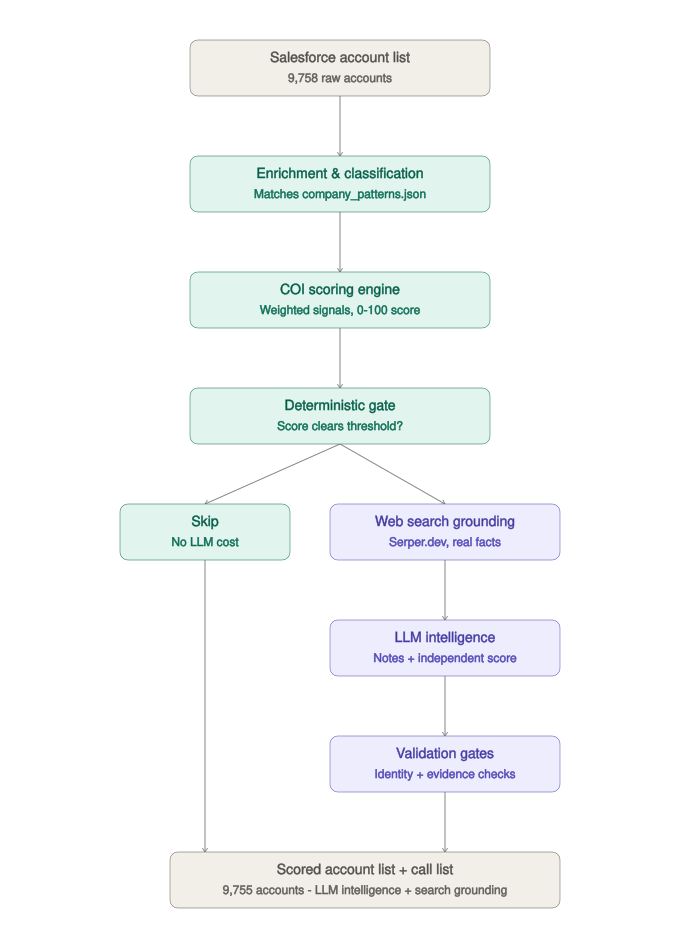

# Couchbase Sales Intelligence Engine

A sales intelligence pipeline that scores Salesforce accounts for genuine Couchbase technical fit, then uses an LLM to generate account-specific discovery prep for qualifying accounts — helping AEs identify who to call, why, and what to ask.

**Built for** Solution Engineers, Enterprise Account Executives, Sales Architects, and Technical Sales teams evaluating large Salesforce account portfolios.

## Features

- 🎯 **Deterministic opportunity scoring** — a transparent, rule-based Couchbase Opportunity Index (COI), no LLM cost for accounts that don't qualify
- ⚙️ **Technical workload identification** — matches accounts against known workload profiles (payment platforms, IoT, real-time analytics, and more)
- 🌐 **Universal web-search grounding** — every account gets a real search (`serper_enrichment_pass.py`), not just ones whose name happens to match a pattern - recovers real signal for accounts a name-only match would otherwise bury by default
- 🔍 **Web-grounded LLM seller intelligence** — real, retrieved facts (via Serper.dev) instead of relying on model memory alone
- ❓ **Automated discovery questions** — a 4-phase, account-specific discovery progression for every qualifying account
- 📋 **AE-ready Excel call briefs** — a polished, filterable call list built directly from the pipeline output
- 📊 **Streamlit dashboard** — a live, interactive view of account intelligence (`app.py`)

<p align="center">
  
</p>
<p align="center"><em>Illustrative sample output — example account names and data, not real customer accounts.</em></p>

## Mission

The COI (Couchbase Opportunity Index) score is only a prioritization mechanism. The real goal is seller intelligence:

- Which accounts should I call?
- Why should I call them now?
- What evidence suggests a genuine Couchbase opportunity?
- What workloads and technical challenges should I explore?
- What discovery questions will create a valuable conversation?

The deterministic pipeline decides *which* accounts qualify. The LLM never scores or qualifies accounts — it generates qualitative seller intelligence for accounts the deterministic engine has already selected.

<p align="center">
  
</p>

Teal = fully deterministic, no LLM cost. Purple = LLM-involved. Accounts on the LLM path are first grounded in real, retrieved facts (`modules/web_search_client.py`, via Serper.dev) before intelligence generation — this exists because word-level prompt constraints alone couldn't fix generic output for accounts the model has no real training-data memory of; see the July 27 design doc section for the full investigation. The independent LLM score sits alongside `overall_coi` for comparison only — it's never blended into it, and a code-enforced cap kicks in whenever the model can't produce a genuine, checkable fact about the named company (see Known Limitations below).

## Architecture

```
Salesforce Account List
        |
        v
Web Search Grounding Merge (optional, if serper_enrichment_pass.py has
been run - merges cached search results in as a FALLBACK signal only,
never overrides a real name-based match)
        |
        v
Normalization -> Industry Classification -> Company Intelligence
(matches against data/company_patterns.json: known_companies ->
 business_patterns -> workload_profiles join)
        |
        v
Technology Enrichment -> Account Intelligence -> Company Archetype
        |
        v
COI Scoring Engine (modules/scoring_engine.py)
  workload fit, database opportunity, real-time requirement,
  technical environment, company context
        |
        v
Deterministic Gate (modules/deterministic_gate.py)
  gate_score = overall_coi + adjustments for database tech /
  modernization / cloud / negative signals
        |
   +---------+---------+
   |                   |
  SKIP        LLM Intelligence Generation
              (single call, per qualifying account):
                - Qualitative: engineering implications,
                  Couchbase POV, discovery questions
                - Independent score: llm_total_score, scored
                  blind to COI/tier/Industry/workloads, using
                  ONLY the account name + the model's own
                  knowledge. Never blended into overall_coi —
                  exists purely to compare against it and
                  surface company_patterns.json coverage gaps.
                  Code-enforced conservative cap applied when
                  the model can't produce a genuine, specific,
                  checkable fact about the named company.
                       |
                       v
              LLM Output Validation
                       |
                       v
          Merge back (validated accounts only)
                       |
                       v
     Excel export + Streamlit JSON export
```

## Example workflow

```
Salesforce Export
       ↓
python main.py                    (score + classify + LLM pass - includes
                                    web search grounding automatically if
                                    SERPER_API_KEY is set, see Setup above)
       ↓
python build_ae_call_list.py      (build the AE-ready Excel call list)
       ↓
Sales rep prepares discovery call
```

**Do not run `rerun_qualified_with_search.py` for a fresh account list.**
It exists only to re-ground a batch that was validated *before* Serper
was added to this codebase. Confirmed 2026-07-29: running it against a
brand-new `main.py` output produces byte-identical results (`main.py`
already grounds via Serper) — real, confirmed wasted spend (~$1.42 on
a 485-account run), not a data-quality issue. See the warning in the
script's own docstring for the full detail.

## Roadmap

- **A single orchestration script that runs the cheap deterministic stages (`main.py`, `classification_prepass.py`) automatically whenever pattern-file or classification code changes, and only sends *changed* accounts through the expensive LLM layer** - the concrete fix for the exact problem found July 28-29: a real rating fix sat correctly in code for days without ever reaching real data, because nothing tied the stages together or flagged that a re-run was needed.
- CRM integration (write intelligence directly back to Salesforce)
- Additional enrichment sources beyond Serper.dev
- Better company recognition for smaller/regional accounts
- Multi-model support (currently Llama 3 70B via Bedrock only)
- Automated persona/stakeholder recommendations

## Setup

```bash
git clone https://github.com/melboulos/couchbase_sales_intelligence_engine.git
cd couchbase_sales_intelligence_engine
python -m venv venv
source venv/bin/activate
pip install -r requirements.txt
```

**AWS credentials** — the pipeline calls Amazon Bedrock (`meta.llama3-70b-instruct-v1:0`) via `boto3`. Configure credentials with access to Bedrock in your environment (`aws configure`, environment variables, or an assumed role) before running `main.py`.

**Web search grounding (optional, but recommended)** — `modules/web_search_client.py` gives the LLM real, retrieved information about each account (via [Serper.dev](https://serper.dev)) instead of relying purely on training-data memory. This exists because prompt-level fixes alone (banning generic phrases, banning specific opening words) proved unable to fix generic output for accounts the model has never heard of — see the July 27 section of the design doc for the full investigation. Set `SERPER_API_KEY` before running - recommended via a `.env` file (this project uses `python-dotenv`, already in `requirements.txt` - `load_dotenv()` runs at the top of every script that needs the key, so it only needs to be set once, not re-exported every terminal session):
```bash
echo 'SERPER_API_KEY="your-key-here"' > .env
```
Or, without a `.env` file (has to be re-exported every new terminal session):
```bash
export SERPER_API_KEY="your-key-here"
```
If unset, the pipeline falls back to memory-only generation automatically — nothing breaks, you just lose the grounding benefit. Serper's free tier (2,500 queries, no card required) is enough to test against a handful of accounts before deciding whether to run it at scale. Accounts with no known `Account State/Province` (about 6% of a typical export) skip search entirely, regardless of whether a key is set — without a location to disambiguate a common company name, a mismatched search result is worse than no search at all (confirmed in testing: two different real companies both named "United Community Bank").

**Input data** — `input/` is gitignored, since account lists typically contain sensitive customer data. Update `INPUT_FILE` in `main.py` to point at your own Salesforce export. Expected columns include at minimum `Account Name` — everything else is read with safe fallbacks and defaults to `"Unknown"` if missing, so a lean export (just name/owner/state/type/dates) works fine. `pipeline/loader.py` also auto-detects and correctly parses Salesforce report exports saved with a `.xls` extension that are actually HTML tables internally (a common export quirk) — no manual conversion needed.

## Running

**Universal grounding pass (optional, recommended before a fresh account list's first run)** — runs a real web search for EVERY account, not just ones a name-based pattern already recognizes. Free to re-run: results are cached by Account Name in `output/serper_search_cache.xlsx` and checked before any new search happens, so re-running against the same list costs nothing, and adding new accounts only searches the delta:
```bash
python serper_enrichment_pass.py   # edit INPUT_FILE at the top first
```
This is separate from, and runs BEFORE, the per-account grounding already described above under "Web search grounding" — that grounding only ever applied to accounts that already qualified for the LLM step. This pass gives every account a fair shot at real signal BEFORE the deterministic gate decides who qualifies at all, so an account with an unrecognizable name isn't stuck at zero signal by default. `main.py` and `precursor_review.py` both merge this cache in automatically if present; if you skip this step, both fall back to name-only matching exactly as before, no error.

**Full pipeline** — scores every account, applies the deterministic gate, and sends qualifying accounts to the LLM:
```bash
python main.py
```
⚠️ **This calls Bedrock and costs real money**, though less than you'd think — a real production run against 9,758 accounts routed 513 to the LLM at ~2,663 tokens/account average, totaling **$0.98** (confirmed against actual Bedrock billing-rate pricing, not estimated). LLM calls run concurrently (5 at a time) and checkpoint to disk every 25 completions, so a crash or dropped connection mid-run loses at most ~25 accounts' worth of progress, not the whole run. Cost scales with how many accounts clear the gate — check `LLM_THRESHOLD` in `modules/deterministic_gate.py`, or run `precursor_review.py` first (below) to see the real number before spending anything.

Every run also prints a line like `Web search grounding: X / Y validated accounts used a real search result`, with a warning if that rate drops below 10%. **This is about a different thing than `serper_enrichment_pass.py`** - it reports on the LIVE, per-account search that happens during the LLM step (`modules/sales_intelligence_pipeline.py`), not on whether the shared classification-stage cache is up to date. A low number here does NOT mean "go run `serper_enrichment_pass.py` again" - it means something is wrong with that specific live search call (a real bug, a rate-limit, an outage) and is worth investigating directly. Running `serper_enrichment_pass.py` before every new account list is a separate, unconditional habit worth keeping regardless of what this line says - it's free and instant for accounts already cached, so there's no reason to wait for a signal before running it.

**Precursor review** — runs enrichment/scoring/gate only, with zero LLM calls, so you can see exactly how many accounts would qualify (and an estimated cost) before running the real thing:
```bash
python precursor_review.py   # edit INPUT_FILE at the top first
```
If a large fraction of accounts land in Tier 4 Monitor, `review_tier4_full.py`, `review_tier4_sample.py`, `analyze_partial_signal_distribution.py`, `near_threshold_differential.py`, and `vertical_laggard_check.py` are one-off tools (not part of the pipeline itself) for investigating whether that's genuine low-fit or a `data/company_patterns.json` coverage gap — see the July 25 section of `docs/Couchbase_SIP_Design_Doc_Update_2026-07-24.md` for how they were used to find real gaps in a production file.

**Smoke test** — re-runs enrichment, scoring, and the LLM against a small hardcoded set of accounts, without needing a full run first:
```bash
python test_llm_validation.py
```

**AE call list export** — builds a clean, formatted Excel file (Summary with industry heat map, Overview, per-account Call Briefs) from the output of `main.py`:
```bash
python build_ae_call_list.py
```

**Dashboard**:
```bash
streamlit run app.py
```

## Re-running failed/flagged accounts

`pipeline/llm_validation_pipeline.py` checks `output/llm_validation_results.xlsx` on each run. Accounts already marked `llm_validation == True` are kept as-is; anything `False` or missing is (re)sent to the LLM. To force a specific account to re-run, open that file, set its `llm_validation` cell to `FALSE`, save, and re-run `main.py` — only that account gets reprocessed.

## Output files (all in `output/`, gitignored)

| File | Contents |
|---|---|
| `serper_search_cache.xlsx` | Raw web-search snippets for EVERY account, keyed by Account Name, from `serper_enrichment_pass.py`. Checked before any new Serper call, so re-running costs nothing for accounts already cached |
| `<input-name>_Scored.xlsx` (name matches `OUTPUT_FILE` in `main.py`) | Full account list with COI, tier, and validated LLM intelligence merged in — including `llm_total_score` (independent LLM score, for comparison against `overall_coi` only, never blended into it), `llm_specific_fact`, `llm_company_recognized`, `llm_recognition_verified`, `llm_score_capped`, `llm_narrative_caveated` (unverified recognition — narrative built on an assigned category, not confirmed company knowledge), `llm_narrative_generic`/`llm_discovery_generic` (measurement-only flags for template convergence, don't block anything), `llm_constraint_violated` (the specific_constraint field mentioned a product/category name and got rejected), `llm_used_web_search` (this account's facts came from a real, live search result, not just model memory) |
| `account_intelligence.json` | Same data, shaped for the Streamlit dashboard |
| `AE_Call_List.xlsx` | Formatted deliverable for AEs — Summary, Overview, Call Briefs. Deliberately excludes the independent-scoring fields above; those are for internal gap-finding, not seller-facing |
| `llm_validation_results.xlsx` | Checkpoint file used for the per-row re-run logic below. Updated incrementally every 25 completions during a run, not just at the end |
| `llm_token_summary.xlsx` | Token counts and real cost for the most recent LLM run |
| `precursor_review.xlsx`, `tier4_full_review.xlsx`, `tier4_sample_for_review.xlsx`, `near_threshold_accounts.xlsx`, `vertical_laggard_sample.xlsx` | Outputs of the analysis scripts described above — not pipeline outputs, just working files for pattern-coverage investigation |

## Known limitations

- **Account Name is not a unique key.** This dataset has confirmed genuine duplicate names for different accounts (e.g. two different "United Community Bank" entries with different CB Account Numbers). Anywhere a merge/lookup is keyed on Account Name, duplicate-named accounts will receive the same merged LLM result (whichever was processed first) rather than their own. A real fix would require joining on a unique account ID instead, if your export reliably includes one.
- **`llm_specific_fact` passing validation doesn't mean it's true.** `validate_recognition_evidence()` only checks that the stated fact isn't generic industry-template language — it can't verify factual accuracy without an external lookup. Confirmed in production: BayMark Health Services (a real addiction-treatment provider) was described as "a healthcare technology company" — a fabricated but specific-sounding fact that passed validation. Web search grounding (above) reduces how often this happens, since the model has real text to draw from instead of guessing, but doesn't eliminate it — a search result can itself be misread or a company can still be conflated with a similarly-named one despite the location cross-check. Mitigated by `build_ae_call_list.py` never surfacing these fields to reps directly; `llm_used_web_search` and `llm_narrative_caveated` flags on the Call Brief title tell a rep at a glance whether an account's narrative is grounded in a real search result, unverified, or neither.
- **The Couchbase point of view narrative resists full de-genericization.** `specific_constraint`/`distributed_solution` (split from a single free-text field specifically to code-check for product-name leakage) reliably avoid naming "database"/"distributed"/"Couchbase" now, and web search grounding measurably enriches the underlying facts — but the sentence *structure* itself ("[concurrency word] updates to [domain noun] during peak [domain] period(s)") still converges across genuinely unrelated accounts. Confirmed via direct testing across 11 real accounts spanning banking, healthcare, hospitality, and fintech. This appears to be a structural habit of the model rather than something further word-level prompt constraints can fix — see the July 27 design doc section for the full investigation before attempting another round of prompt changes here.
- **A code fix and a fix actually reaching real data are two different things — confirmed the hard way.** The insurance/pharma base-rating fix (raising `database_intensity`/`operational_complexity` from `2,2` to `3,3`, first made July 25) was correctly written into `data/company_patterns.json` the whole time — but `main.py` (the only script that actually *applies* that file to compute real scores) was never re-run afterward. Every later stage of the pipeline, including the July 27-28 web search/RAG work, was unknowingly built on deterministic scores computed with the *old* rating. The same gap affected the three keyword-collision fixes (`api`/"Capital", `power`/"Empower", `card`/"Cardiology") — all correctly written into code, none of it reaching real data until `main.py` was finally re-run on July 28. Confirmed directly: `KPS Capital Partners, LP` was still tagged `Technology / SaaS` in real output hours after the fix was "done." This is now a standing lesson for this codebase: any fix to `modules/company_intelligence.py`, `modules/scoring_engine.py`, or `data/company_patterns.json` requires a fresh `main.py` run before it's real, not just a code change - `verify_deterministic_layer.py` checks the code/data are correct, not that they've been applied to the actual scored file, and is a real, known blind spot until an orchestration script exists to close it (see Roadmap).
- **Insurance, Pharma & Medical Device, and Utilities all shared the identical `(3, 3, 2)` rating as of July 25, producing a striking, confirmed side effect: 98.5% of a 136-account Insurance/Pharma sample converged on the exact same COI, mostly landing one point below the Tier 3 cutoff.** Investigated directly with the user on July 28-29: Pharma was deliberately separated out with its own `realtime_requirement: 3` (distinct from Insurance and Utilities' `2`), specifically chosen because Pharma & Medical Device workloads (manufacturing operations, supply chain, regulatory data) were judged a stronger real Couchbase fit than Insurance or Utilities. Confirmed on real data: 30 of 33 Pharma accounts moved from Tier 4 to Tier 3 as a direct, verified result; Insurance's 103 accounts were deliberately left untouched at the original rating. Elephant-company overrides for individually-verified large accounts still exist on top of these base ratings (see `known_companies` in `data/company_patterns.json`).
- **The model can override or ignore given evidence with its own outside training knowledge, and no code check catches this.** Confirmed in production: Nikon Inc.'s fact explicitly states "51-200 employees," but the narrative describes "Nikon's large customer base" anyway, drawing on background knowledge of the famous parent brand rather than the stated fact about this specific US subsidiary. A milder version shows up whenever a well-known company (Epic Games, a professional sports team) has a thin given fact but a confident, detailed narrative anyway. Explicitly decided not to chase this with more code, alongside a related discovery-phase regression (a banned generic phase objective resurfacing in a near-identical reworded form) — both are semantic judgments ("is this from the given fact or from training knowledge") with no clean, deterministic signal to check, the same reasoning already applied to the pure-fabrication risk above. See the July 28 design doc section for the full review and the reasoning behind stopping here.

- **Universal web-search grounding (`serper_enrichment_pass.py`) recovers real signal, but its keyword-based fallback matching has the same generic-boilerplate risk as name-only matching, just against noisier text.** Three rounds of stratified audits (2026-07-29/30) found and fixed real false positives: `career`/`careers` (near-universal company-profile boilerplate, the single biggest source - explained ~289 of ~2,327 initial LLM candidates on its own), `media@` press-contact emails, `health & wellness`/`medical, dental` benefits-page boilerplate, and several narrower keyword-substring collisions. `power` needed a co-occurrence rule rather than an exclusion list (generic "AI-powered" marketing language outnumbered genuine utility signal ~8x in real data) - `care` likely needs the same treatment but doesn't have it yet (confirmed real "___care" compounds across unrelated industries: "lawn care", "Client Care"). A general "vendor serves an industry" mismatch (a company that sells TO an industry tagged as if it WERE that industry - GE Smallworld selling GIS software to utilities, ParkOps serving retail/hospitality clients) is deliberately NOT generalized into a single rule: chasing it pattern-by-pattern has real diminishing returns, and a general rule risks blocking genuine matches (EqualizeRCM genuinely says "community health providers" and must keep matching Healthcare). See the comments directly above `NON_FIT_INSTITUTION_KEYWORDS` in `modules/company_intelligence.py` for the full, current list of what's fixed versus deliberately left open.
- **Web-search results can be genuinely ambiguous for common names, and no keyword rule fixes this.** Confirmed real cases: "Zapata" (the actual account, an AI/quantum company) returned a snippet blending in an unrelated real estate developer who happens to share the surname; "Venus" (the account) returned an unrelated auto-transport company located in the town of Venus, FL. Accepted as a residual risk of grounding against real search results, not a bug to chase.
- **A "Non-Profit / Charity" industry label isn't the same as a new LLM-cost reduction, and conflating the two overstates impact.** Nonprofit/charity signals now route explicitly to this label instead of collapsing into blank "Unknown" - a real data-quality improvement (a rep can tell "nothing found" apart from "found a nonprofit, correctly deprioritized"), but confirmed directly on real data that ~180 of 190 such accounts were already excluded from the LLM under an earlier, narrower keyword list - only ~10 represent genuinely new exclusions. Verified via `gate_decision`/`workload_profile`, not assumed: all 190 show `SKIP` and blank `workload_profile`, meaning none were ever going to reach the LLM regardless of the label change.

## Project structure

```
main.py                  # Full pipeline entry point
serper_enrichment_pass.py # Universal web-search grounding pass (optional, run before main.py)
app.py                   # Streamlit dashboard
build_ae_call_list.py    # AE-facing Excel export
test_llm_validation.py   # Smoke test on a small account set
config.py

data/                    # Pattern/rule data (company_patterns.json, etc.)
modules/                 # Core logic: enrichment, scoring, gate, LLM prompt/validation
pipeline/                # Orchestration wrappers called by main.py
schemas/                 # Output schema definitions
docs/                    # Design docs
```

## Data sensitivity

`input/` and `output/` are both gitignored. Do not commit real account/customer data to this repository.
